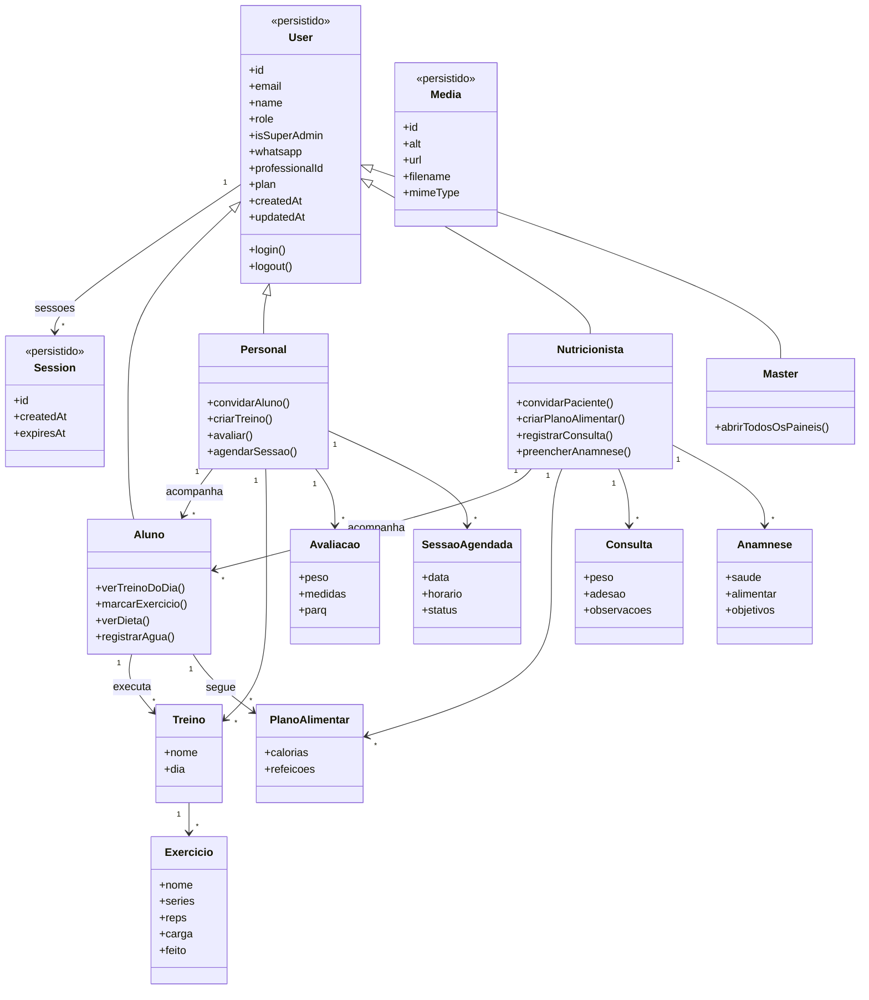

# CoachPass — diagrama de classes

O que está marcado como persistido já existe no Postgres. O restante é o domínio do produto e ainda não grava no banco.

Papéis em `User.role`: `student`, `personal`, `nutritionist`, `master`.

Fora do recorte: questionários, metas, periodização, materno-infantil, cursos e canvas.
